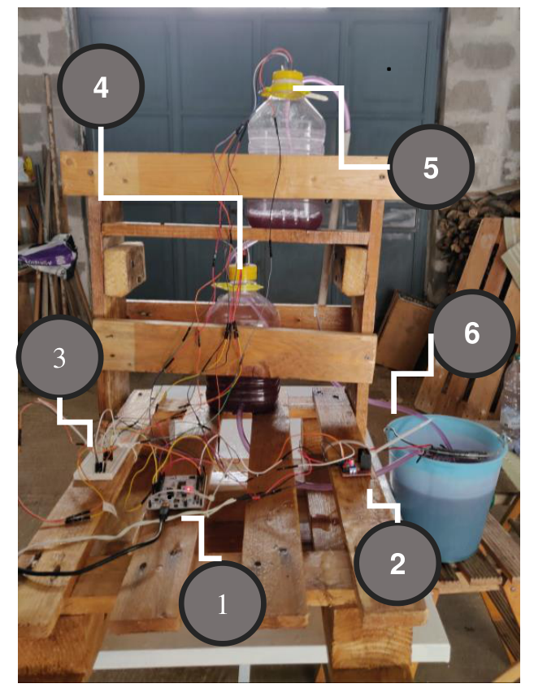
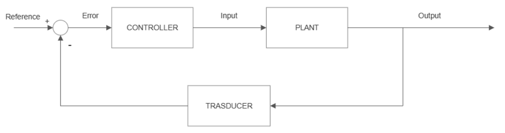
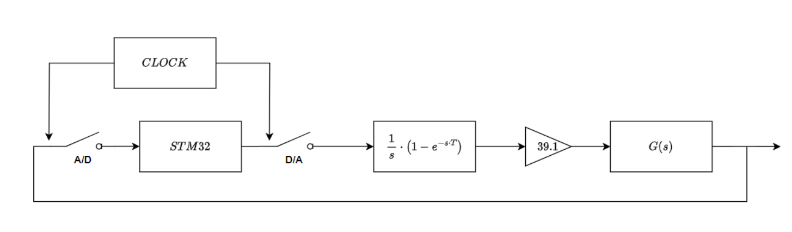
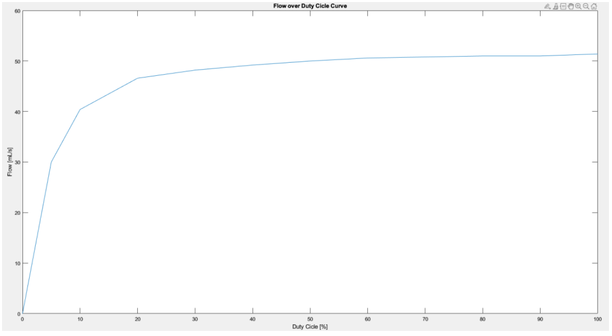
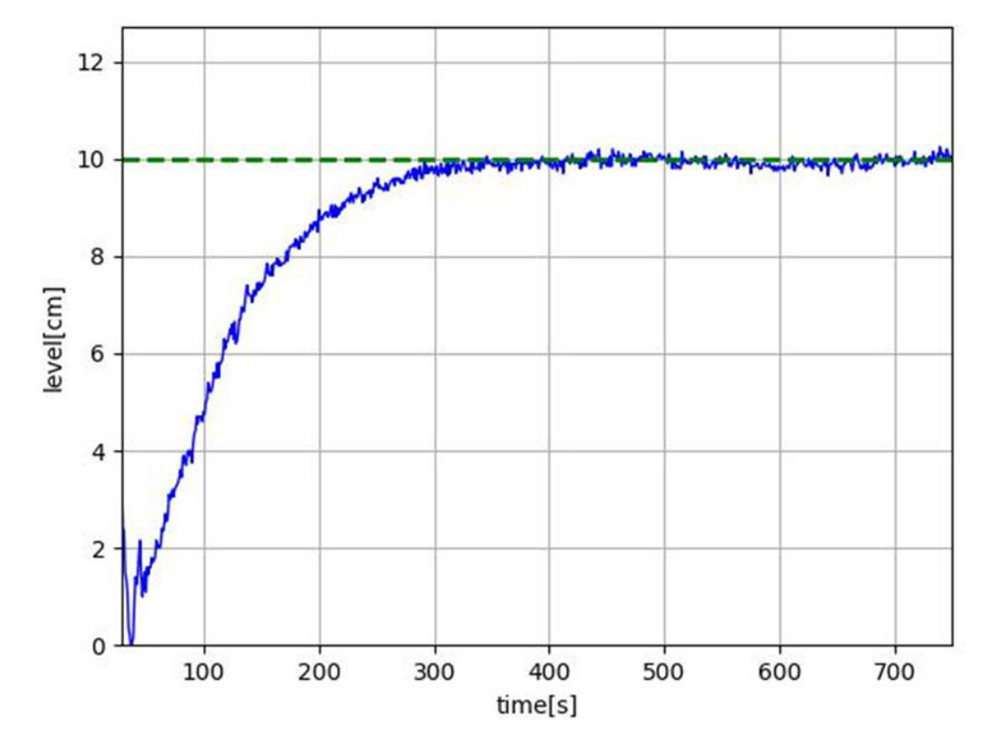
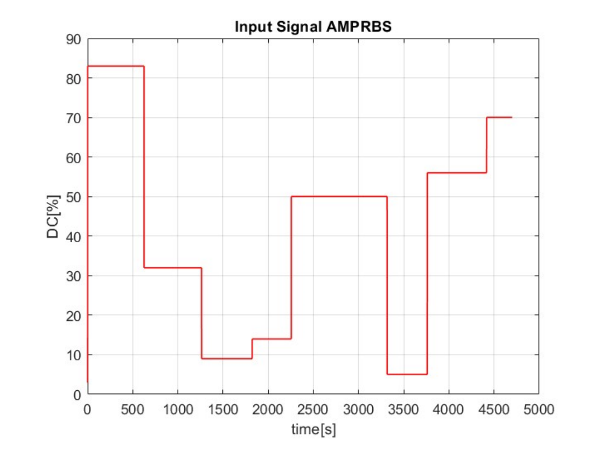
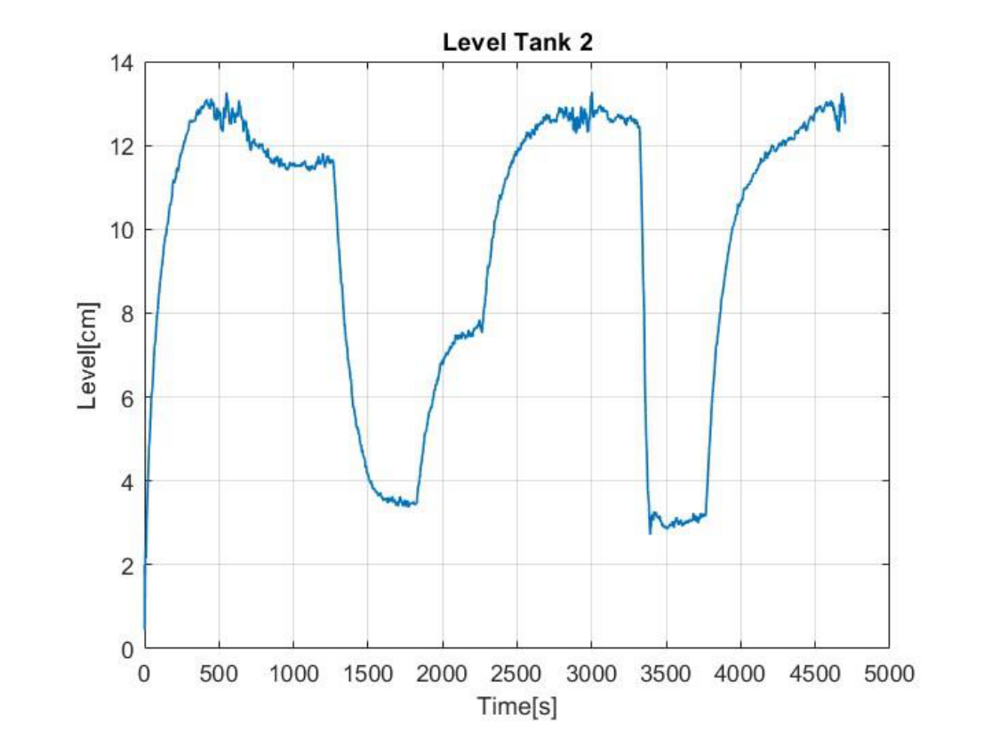
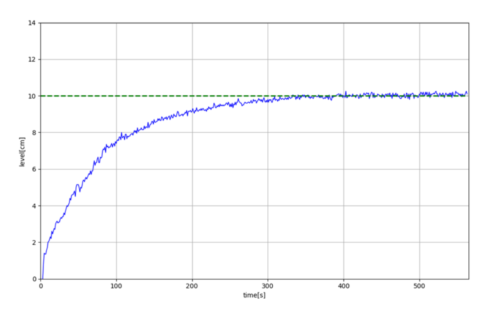
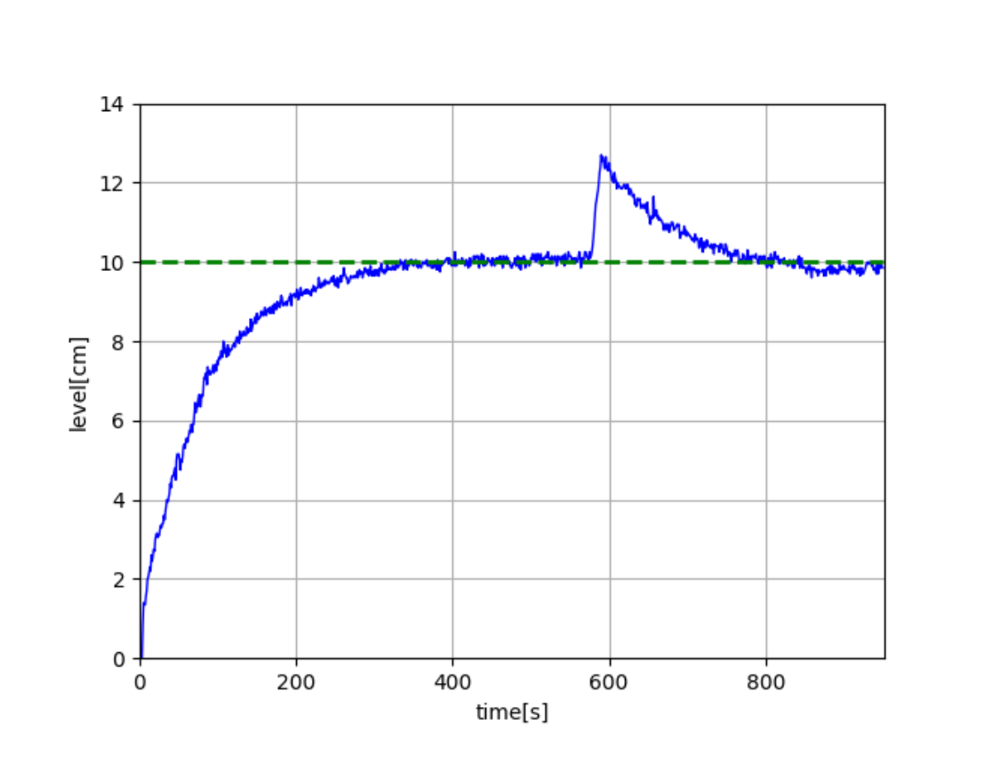
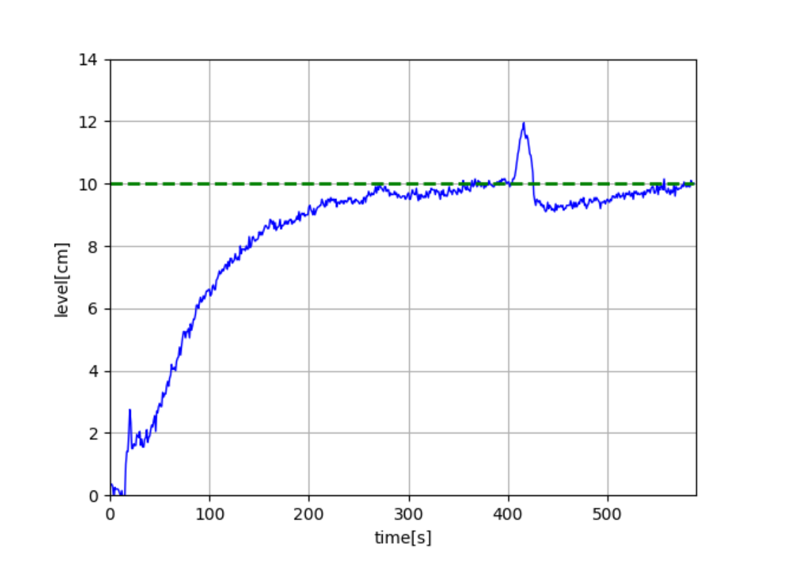

# Embedded water-level control of a two-tank hydraulic plant with STM32


This project implements a complete **embedded closed-loop control system** for regulating the water level of a coupled two-tank hydraulic plant.

The control stack runs on an **STM32 NUCLEO-F411RE** board. Two **VL53L0X Time-of-Flight sensors** measure the water level in the tanks, the measurements are filtered in firmware, and a digital controller computes the duty cycle applied to a **12 V DC pump** through an **HW-095 / L298N motor driver**.

<p align="center">
  
</p>
The numbered elements in the prototype are:

| Label | Component | Role in the system |
|---:|---|---|
| 1 | STM32 NUCLEO-F411RE | Main embedded controller. It reads the level sensors, executes the control algorithm and generates the PWM signal for the pump. |
| 2 | HW-095 / L298N motor driver | Power interface between the STM32 and the 12 V DC pump. It converts the PWM control signal into the actuation voltage applied to the pump. |
| 3 | Breadboards and wiring | Electrical interconnection stage for sensors, driver, power supply and STM32 peripherals. |
| 4 | Tank 2 with VL53L0X sensor | Controlled tank. Its water level is the main output variable regulated by the PID or LQI controller. |
| 5 | Tank 1 with VL53L0X sensor | Intermediate tank. Its level is measured and used as part of the two-tank state representation. |
| 6 | Basin | Water reservoir used to collect the outlet flow and provide the pump inlet supply. |

The controlled variable is the water level in **Tank 2**. The project covers the full engineering workflow: physical plant construction, sensor validation, actuator characterization, nonlinear modelling, linearization, controller design, firmware implementation, real-plant validation and system identification.

---

## 1. Control problem

The objective is to track a target water level in the second tank by modulating the pump flow injected into the first tank.

At each sampling instant, the embedded controller must:

1. acquire the distance measurements from both VL53L0X sensors;
2. map distances into tank water levels;
3. filter the measured levels to reduce sensor noise;
4. compute the control input using the selected controller;
5. saturate the command in the admissible duty-cycle range;
6. update the PWM compare register driving the pump.

The main control variables are:

| Symbol | Meaning |
|---|---|
| `x1` | Water level in Tank 1 |
| `x2` | Water level in Tank 2 |
| `r` | Reference level for Tank 2 |
| `u` | Pump input flow / actuation command |
| `DC` | PWM duty cycle applied to the motor driver |
| `Ts` | Digital control sampling time |

The implemented reference used during validation is:

```text
r = 10 cm
Ts = 1 s
```

---

## 2. System architecture

The plant is controlled through a sampled-data feedback loop. The analog hydraulic process is interfaced with the STM32 through sensor acquisition and PWM actuation.

<p align="center">
  
</p>

The embedded control architecture includes the microcontroller, the sampling mechanism, the PWM-based digital-to-analog actuation stage and the continuous hydraulic plant.

<p align="center">
  
</p>

The firmware follows a modular structure:

| Module | Engineering role |
|---|---|
| `sensors.c` / `sensors.h` | VL53L0X initialization, multi-sensor addressing, ranging and level mapping |
| `MovingAverageFilter.c` / `MovingAverageFilter.h` | Filtering of noisy level measurements |
| `Motor.c` / `Motor.h` | Pump abstraction, PWM duty-cycle conversion and saturation |
| `control.c` / `control.h` | PID and LQI controller implementation |
| `main.c` | Peripheral initialization, control-loop execution and controller selection |

---

## 3. Hardware platform

| Component | Selection | Role |
|---|---|---|
| Microcontroller | STM32 NUCLEO-F411RE | Executes the digital controller and manages peripherals |
| Level sensors | 2 × VL53L0X ToF sensors | Measure the distance from the sensor to the liquid surface |
| Actuator | AD20P-1230C 12 V DC pump | Injects water into Tank 1 |
| Motor driver | HW-095 / L298N H-bridge | Converts the STM32 PWM command into motor actuation |
| Plant | Two coupled tanks | Hydraulic process to be controlled |
| Power stage | External 12 V supply | Pump supply |
| Communication | I2C, USART | Sensor bus and debug interface |

The selected STM32 board provides the GPIO lines, timers and I2C interface required for the full control loop.

---

## 4. Measurement subsystem

The two VL53L0X sensors share the same I2C bus. Since both devices have the same default address, they are booted sequentially using dedicated `XSHUT` pins. After each sensor is released from reset, the firmware assigns a unique I2C address.

| Sensor | Assigned I2C address |
|---|---:|
| VL53L0X 1 | `0x54` |
| VL53L0X 2 | `0x56` |

The sensors are configured in **high-accuracy mode**. This choice increases measurement time, but it is compatible with the slow dynamics of the hydraulic plant.

The measured water level is computed as:

```math
h_i = h_{sensor,i} - d_i
```

where `d_i` is the measured distance returned by the ToF sensor.

### Sensor validation

A dedicated validation test was performed to evaluate the quality of the ToF measurement on water. The sensor response improved when the liquid reflectance and density were increased using salt and tempera paint.

| Liquid | Measurement fluctuation |
|---|---:|
| Water | approximately `±5 mm` |
| Water + salt + tempera paint | approximately `±3 mm` |

This result motivated the use of filtering in the embedded firmware.

---

## 5. Actuation subsystem

The pump is driven through the HW-095 / L298N driver. The STM32 generates:

- one PWM signal for pump speed control;
- two GPIO outputs for the H-bridge direction inputs.

The PWM signal is generated using **TIM2**.

| Parameter | Value |
|---|---:|
| PWM timer | `TIM2` |
| Prescaler | `1` |
| Auto-reload register | `4199` |
| PWM frequency | approximately `10 kHz` |
| Duty-cycle range | `0% - 100%` |

A pump characterization test was performed by applying increasing duty-cycle values and measuring the output flow.

<p align="center">
  
</p>

The curve shows a nonlinear actuator characteristic: the flow increases rapidly at low duty-cycle values and then approaches a quasi-saturated region. For this reason, the firmware explicitly saturates the controller output before writing the PWM compare register.

---

## 6. Plant model

The plant is a coupled two-tank hydraulic system. The state variables are the water levels in the two tanks:

```math
x(t) = \begin{bmatrix} x_1(t) \\ x_2(t) \end{bmatrix}
```

The outlet flow is modelled using Torricelli's law. This produces a nonlinear state-space model:

```math
\dot{x}_1(t) = -\frac{K_1}{A_1}\sqrt{x_1(t)} + \frac{1}{A_1}u(t)
```

```math
\dot{x}_2(t) = \frac{K_1}{A_2}\sqrt{x_1(t)} - \frac{K_2}{A_2}\sqrt{x_2(t)}
```

```math
y(t) = x_2(t)
```

The main physical parameters are:

| Parameter | Meaning | Value |
|---|---|---:|
| `A1` | Tank 1 section | `225 cm²` |
| `A2` | Tank 2 section | `225 cm²` |
| `ht1`, `ht2` | Tank height | `28.5 cm` |
| `s1` | Tank 1 outlet section | `0.5025 cm²` |
| `s2` | Tank 2 outlet section | `0.1963 cm²` |
| `g` | Gravity acceleration | `981 cm/s²` |

A linearized model was obtained around the operating point and used for model-based controller tuning.

---

## 7. Controller design

Two digital controllers are implemented in the STM32 firmware.

### PID controller

The PID controller computes the pump duty cycle from the tracking error on Tank 2:

```math
e(k) = r(k) - x_2(k)
```

The model-based PID gains are:

| Gain | Value |
|---|---:|
| `Kp` | `1.8410` |
| `Ki` | `0.0118` |
| `Kd` | `60.8833` |

The controller output is saturated to keep the command inside the admissible PWM duty-cycle range.

### LQI controller

The Linear Quadratic Integral controller extends state feedback with integral action. It is used to improve reference tracking and reduce steady-state error.

The implemented LQI gain vector is:

| Gain | Value |
|---|---:|
| `K1` | `15.7345` |
| `K2` | `23.1724` |
| `K3` | `-0.3162` |

The selected controller can be changed inside the timer callback in `main.c`.

---

## 8. Experimental validation

The controllers were tested on the physical plant using a `10 cm` reference for Tank 2 and a control sampling time of `1 s`.

The LQI controller designed from the mathematical model achieved stable reference tracking on the real plant.

<p align="center">
  
</p>

The real response confirmed that the mathematical model was sufficient to obtain a working controller, but the mismatch between simulation and real plant dynamics motivated a dedicated identification phase.

---

## 9. System identification

The real plant was identified using an **APRBS input signal** applied to the pump duty cycle. The output signal was the measured water level of Tank 2.

<p align="center">
  
</p>

<p align="center">
  
</p>

A Hammerstein SISO model was used to approximate the real nonlinear plant. The identified transfer function was then used to retune the PID controller.

The PID gains obtained from the identified model are:

| Gain | Value |
|---|---:|
| `Kp` | `3` |
| `Ki` | `0.0757` |
| `Kd` | `1.48` |

The identified PID controller produced a real settling time close to the simulation result.

<p align="center">
  
</p>

A disturbance test was also performed by partially blocking the outlet of Tank 2. The identified PID recovered faster than the LQI controller tuned on the mathematical model.

<p align="center">
  
</p>

<p align="center">
  
</p>

---

## 10. Firmware implementation

The STM32CubeMX configuration is stored in:

```text
Code_Project_v_1.ioc
```

The main configured peripherals are:

| Peripheral | Configuration role |
|---|---|
| `I2C` | Communication with the VL53L0X sensors |
| `TIM2` | PWM generation for pump actuation |
| `TIM1` | Periodic timing for the control action |
| `GPIO` | Pump direction pins and VL53L0X `XSHUT` pins |
| `USART` | Debug and serial monitoring |

The control action is executed from a timer-based callback. This keeps the actuation update periodic and decoupled from the continuous sensor polling performed in the main loop.

---

## 11. Repository structure

```text
.
├── Core/
│   ├── Inc/
│   │   ├── control.h
│   │   ├── gpio.h
│   │   ├── i2c.h
│   │   ├── main.h
│   │   ├── Motor.h
│   │   ├── MovingAverageFilter.h
│   │   ├── sensors.h
│   │   ├── tim.h
│   │   └── usart.h
│   │
│   ├── Src/
│   │   ├── control.c
│   │   ├── gpio.c
│   │   ├── i2c.c
│   │   ├── main.c
│   │   ├── Motor.c
│   │   ├── MovingAverageFilter.c
│   │   ├── sensors.c
│   │   ├── tim.c
│   │   └── usart.c
│   │
│   └── Startup/
│       └── startup_stm32f411retx.s
│
├── Drivers/
│   ├── CMSIS/
│   ├── STM32F4xx_HAL_Driver/
│   └── VL53L0X/
│
├── assets/
│   ├── real_plant.png
│   ├── control_loop.png
│   ├── digital_control_architecture.png
│   ├── pump_flow_duty_cycle.png
│   ├── lqi_real_response.png
│   ├── identification_aprbs_input.png
│   ├── identification_tank2_output.png
│   ├── identified_pid_real_response.png
│   ├── pid_disturbance_response.png
│   └── lqi_disturbance_response.png
│
├── docs/
│   └── Report_Project.pdf
│
├── Code_Project_v_1.ioc
├── STM32F411RETX_FLASH.ld
├── STM32F411RETX_RAM.ld
└── README.md
```

---

## 12. Build and flashing instructions

### Requirements

To build and flash the firmware, the following tools are required:

- STM32CubeIDE;
- STM32 NUCLEO-F411RE board;
- ST-LINK debugger;
- USB cable;
- ARM GCC toolchain, included with STM32CubeIDE.

### Import the project

```bash
git clone https://github.com/mikabba/stm32-two-tank-control.git
```

Then open STM32CubeIDE and select:

```text
File > Import > Existing Projects into Workspace
```

Select the cloned repository folder and build the project using the `Debug` configuration.

### Flash the firmware

Connect the NUCLEO board through USB and use:

```text
Run > Debug
```

or:

```text
Run > Run
```

The firmware can also be flashed with STM32CubeProgrammer if a `.elf`, `.hex` or `.bin` file is generated locally.

---

## 13. Documentation

The complete technical report is available in:

```text
docs/Report_Project.pdf
```

The report includes hardware design, sensor configuration, actuator characterization, mathematical modelling, controller design, firmware implementation, experimental results and final conclusions.

---

## 14. Version-control notes

The repository should contain source files, configuration files, documentation and required drivers.

Generated build artifacts should not be committed:

```text
Debug/
Release/
*.elf
*.o
*.d
*.su
*.map
*.list
*.bin
*.hex
.metadata/
```

---

## 15. Authors

- Michele Abbaticchio
- Antonio Camposeo
- Fabio Ceglie
- Christian Fonseca

---

## 16. Academic context

Project developed for the **Embedded Control** course.

Professor:

- Prof. Luca De Cicco

---

## 17. License

This project is intended for academic and educational purposes.
